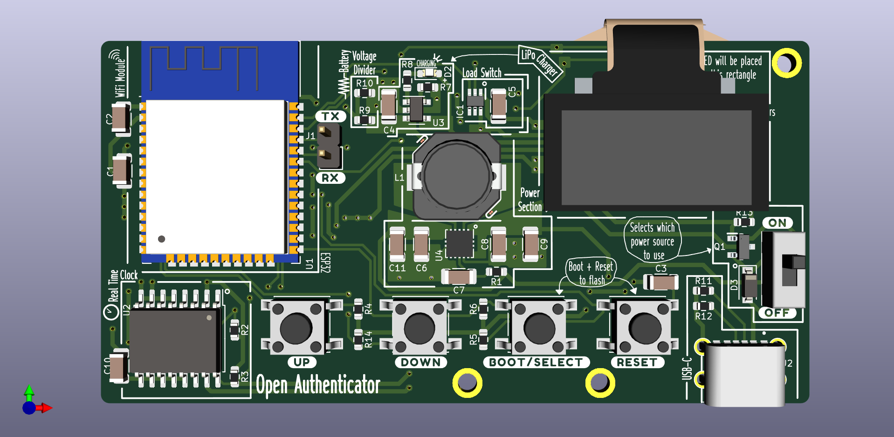
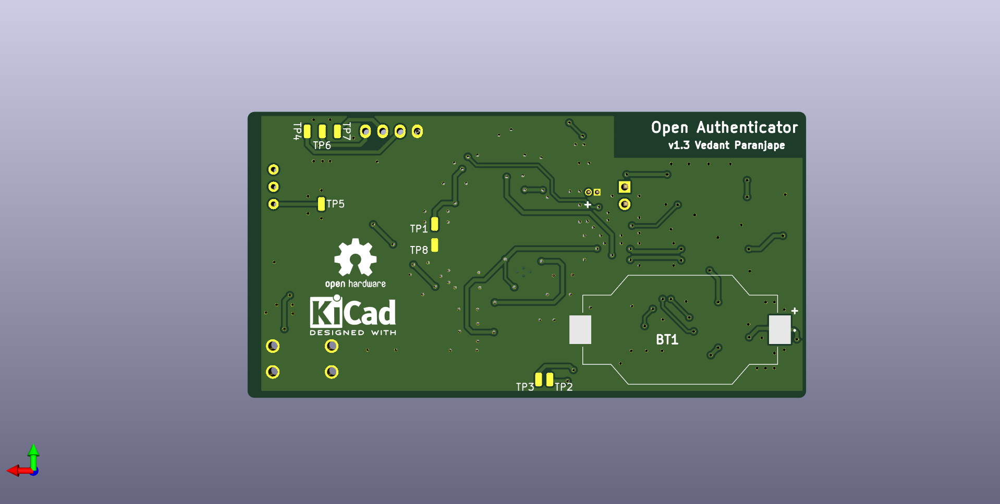

# Open Authenticator Hardware Design

This repository contains hardware design files and datasheets for the open authenticator. This project is in development and is not ready for release.

<a href="https://oshpark.com/shared_projects/kZuvm8FV"></img></a>


## Features

* Small form factor of 82mm x 42mm
* Uses ESP32-WROOM-32D module
* Uses 128x64 0.96" inch OLED module
* Uses DS3231 RTC with battery backup (CR2032) for timekeeping
* Powered by 3.7V 300 mAh LiPo battery
* Uses MCP73831 for charging LiPo battery
* Uses TPS63001 Buck Boost Converter IC for efficient 3.3V power supply, with input range from 1.8V - 5.5V
* Uses TPS22919 Load switch to control power to OLED and RTC chip
* Autoselect power source, i.e., battery or USB
* USB Type-C for charging only (no data pins connected)

## Project Structure

```
/datasheets - contains datasheets of various components used in the pcb
/kicad_project - contains kicad project files for the pcb
/schematics - contains schematics of the the pcb
```

## Tools

To view/modify the files from this repository, install KiCAD from: [https://kicad.org](https://kicad.org)

## Schematics


## Plots

### Front side



### Back side



